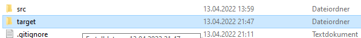
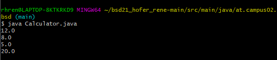

# Exercise 3

Nach der Ausführung des "Calculator" Programmes wurde ein neuer Ordner namens "Target" erschaffen. Darin befindet sich unser erstelltes Package. Im Innersten finden wir eine Class-Datei des "Calculator" Programmes.

  

    